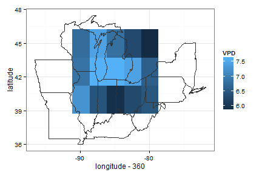

climate-utils
=============


### ClimateUtils: exploring, transforming, and plotting climate data

### How to downloading and install


```r
install.packages("devtools")
library(devtools)
install_github("climate-utils", "dlebauer")  ## takes a while, lots of data
```


### Example downloading RH and T, then calculating and plotting VPD

Here is an example of using the ClimateUtils package to calculate amd map summer VPD (vapor pressure deficit) in the midwest US.

The steps are:

#### run `get.ncep.vpd`

This function is a wrapper for the `NCEP.gather` function (from the RNCEP package). It combines the following steps:

1. downloads relative humidity and temperature from NCEP
2. calculates VPD using the `get.es` and `get.vpd` functions 

See `?get.ncep.vpd`, `?get.es`, and `?get.vpd` for details


#### Plot VPD 


```r
library(ClimateUtils)

## Download RH, T from NCEP and calculate VPD
midwest.vpd <- get.ncep.vpd(lat = c(40, 45), lon = c(-90, -82), years = c(2010, 
    2012), months = c(6, 8))
```

```
## [1] Units of variable 'air.sig995' are degK
## [1] Units of variable 'rhum.sig995' are %
```


```r
states <- map_data("state", region = c("michigan", "wisconsin", "illinois", 
    "indiana", "ohio", "pennsylvania", "new york", "iowa", "missouri", "kentucky", 
    "west virginia"))

## Plot it
ggplot() + geom_raster(data = midwest.vpd, aes(longitude - 360, latitude, fill = VPD)) + 
    geom_polygon(data = states, aes(long, lat, group = group), color = "grey20", 
        alpha = 0) + theme_bw()
```

 


### References:

VanLoocke et al 2012 A regional comparison of water use efficiency for miscanthus, switchgrass and maize  http://www.sciencedirect.com/science/article/pii/S0168192312001931

Hartmann, D. Global Physical Climatology. Academic Press
